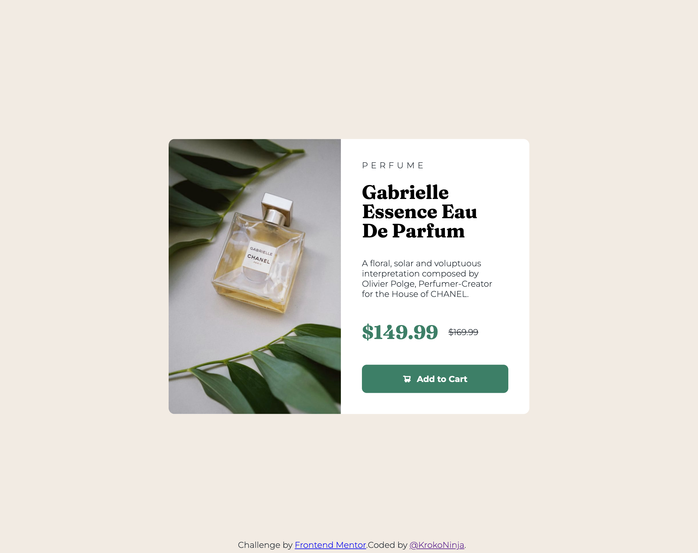
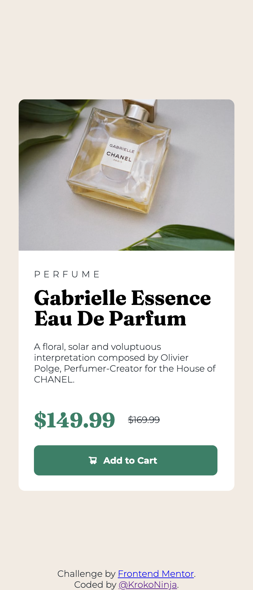

# Frontend Mentor - Product preview card component solution

This is a solution to the [Product preview card component challenge on Frontend Mentor](https://www.frontendmentor.io/challenges/product-preview-card-component-GO7UmttRfa). Frontend Mentor challenges help you improve your coding skills by building realistic projects.

## Table of contents

- [Overview](#overview)
  - [The challenge](#the-challenge)
  - [Screenshot](#screenshot)
  - [Links](#links)
- [My process](#my-process)
  - [Built with](#built-with)
  - [Continued development](#continued-development)
- [Author](#author)

## Overview

### The challenge

Users should be able to:

- View the optimal layout depending on their device's screen size
- See hover and focus states for interactive elements

### Screenshot

### Links

- Solution URL: [Solution on Front End Mentor](https://www.frontendmentor.io/solutions/product-preview-card-component-hv39Icjp8Y)
-Live Site URL: [Live Site of the Challenge](https://krokoninja.github.io/fem-product-view-card-component/)

## My process

### Built with

- Semantic HTML5 markup
- CSS custom properties
- Flexbox
- Mobile-first workflow

### Continued development

I want to improve on responsive designs and become more familiar with CSS Flexbox.
In Addition I also want to improve my general skills in HTML and CSS.

## Author

- Frontend Mentor - [@KrokoNinja](https://www.frontendmentor.io/profile/krokoninja)
